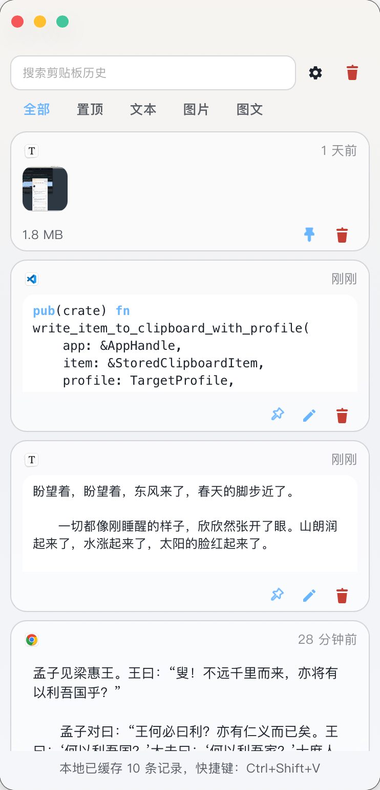
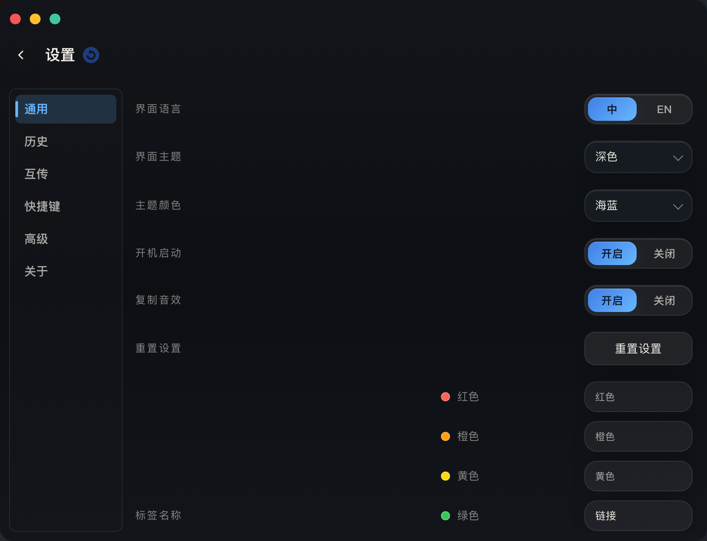
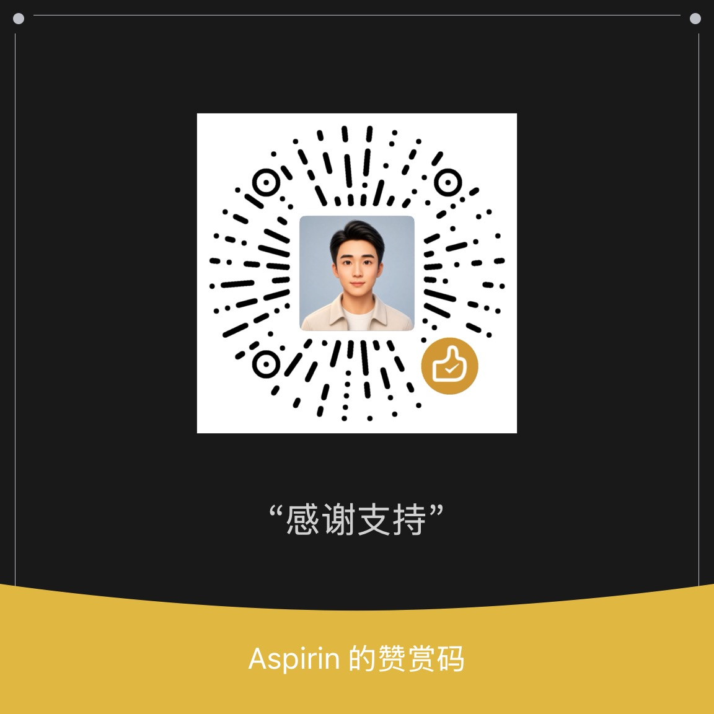

# Power Paste

Power Paste is a desktop clipboard history manager built with `Tauri 2`, `Vue 3`, and `Rust`. It focuses on a native-feeling workflow: watch clipboard changes in the background, open a compact panel with a global shortcut, then quickly search, preview, copy, edit, tag, or paste older items back into the last target application.

The current implementation is local-first. Clipboard history is stored in SQLite on the device, settings are persisted in `settings.json`, and phone transfer runs over a temporary local-network session served by the desktop app itself.

中文说明见 [README.zh-CN.md](./README.zh-CN.md)。

## Product Preview

### Demo Video

<video src="./docs/demo-video.mp4" controls width="100%" title="Power Paste demo video"></video>

[Watch the demo video](./docs/demo-video.mp4)

| Main Panel(Light) |Settings(Dark)|
|---|---|
|  | |

## Why Power Paste

- Fast: open the panel with a global shortcut and bring previous clipboard content back in seconds
- Native-feeling: designed around desktop workflows instead of browser-like interaction patterns
- Good-looking: translucent surfaces, theme switching, and accent colors are part of the product value
- Meant to stay around: tray support, single-instance behavior, and update checks make it practical as an always-available companion

## Highlights

- Global shortcut to toggle the main history panel
- Capture `text`, `link`, `image`, and `mixed` clipboard content
- Search and filter by `All`, `Pinned`, `Text`, `Image`, and `Mixed`
- Pin important items and keep them out of bulk clear / retention cleanup
- Favorite items for an extra visual priority marker
- Finder-style color tags: up to 3 tags per item, with 7 fixed colors and customizable labels
- Edit plain-text history items in place
- Copy history items back to the system clipboard, or paste directly to the previous target app when supported
- Hover image thumbnails to preview larger images
- Local-network phone transfer for text, images, and files through a browser page opened by scanning a QR code
- Settings for language, theme, accent color, density, launch on startup, sound, history retention, image-size limit, transfer directory, tag labels, debug mode, and global shortcut
- Tray integration, single-instance behavior, automatic update checks, and manual update checks
- Custom in-app confirmation dialogs instead of system confirm prompts for destructive actions

## Current Feature Set

### History Workflow

- Compact transparent panel with keyboard-first navigation
- Accurate item count for the current query and filter state
- `Enter` pastes the selected item on supported platforms
- `Ctrl/Cmd + C` copies the selected item back to the clipboard
- Double-click can trigger direct paste when the current platform supports it
- Links can be opened in the system default browser
- `Clear History` removes only unpinned items

### Item Types

- `Text`: searchable, editable, copyable, directly pasteable on supported platforms
- `Link`: detected from copied URLs and openable in the default browser
- `Image`: thumbnail preview, hover preview, clipboard replay on supported platforms
- `Mixed`: combined text + image payloads where the backend can preserve or replay them

### Tags and Organization

- Each history item can carry up to `3` tags
- Built-in tag colors match the Finder-style palette: `red`, `orange`, `yellow`, `green`, `blue`, `purple`, `gray`
- Tag color and display name are separate
- Tag names are editable from settings
- Tag filters are available directly in the main panel

### Phone and PC Transfer

- Start a temporary LAN transfer session from the desktop app
- Scan a QR code with a phone to open a browser-based transfer page
- No mobile app is required
- Send text and files from desktop to phone
- Send text, images, and files from phone to desktop
- Files received on desktop are saved to the configured download directory
- Desktop-side transfer history can open or reveal received files
- Session status shows connected / disconnected state and is cleaned up after idle timeout

### Settings

The settings view is split into these categories:

- `General`
- `History`
- `Transfer`
- `Shortcuts`
- `Advanced`
- `About`

Current configurable options include:

- Language: Simplified Chinese / English
- Theme mode: Light / Dark / System
- Accent color: Ocean / Amber / Jade / Rose
- Density: compact / cozy
- Launch on startup
- Copy sound on capture / replay
- Maximum history item count
- Maximum retention days for unpinned history
- Maximum stored image size
- Tag display names
- LAN transfer download directory
- Global shortcut recording / clearing
- Debug mode

Update checks are not configured as a regular setting. The app checks for updates on startup, shows an update badge in the UI when a new version is available, and also exposes a manual tray action.

## Platform Status

- Windows: primary target platform, and currently the strongest platform for mixed clipboard replay and target-aware direct paste
- macOS: direct paste depends on system Accessibility / Automation permission
- Linux: direct paste depends on `X11 + xdotool` or `Wayland + wtype`; when the required tool is missing, the UI now shows an explicit install hint instead of a generic unsupported message; mixed replay still degrades to a single preferred payload

### Linux Notes

- `xdotool` and `wtype` are optional runtime dependencies. They are only required for direct paste back into the previous target app.
- In `X11` sessions, install `xdotool` to enable direct paste.
- In `Wayland` sessions, install `wtype` to enable direct paste.
- If the required tool is missing, Power Paste will keep copy-back available and show a targeted installation hint for the current session type.

### macOS Permission Reset After Upgrade

If direct paste still reports missing Accessibility or Automation permission after upgrading from an older build, macOS may still associate the permission record with the previous app bundle. Re-authorize Power Paste with these steps:

1. Quit Power Paste.
2. Run:

```bash
xattr -dr com.apple.quarantine /Applications/Power\ Paste.app
```

3. Open `System Settings > Privacy & Security > Accessibility` and toggle Power Paste off, then on again.
4. Open `System Settings > Privacy & Security > Automation` and re-enable Power Paste if it appears there.
5. Start Power Paste again and retry direct paste.

## Architecture Notes

- History uses SQLite as the single source of truth
- Frontend state is event-driven and does not replace SQLite as the canonical store
- Settings are persisted in `settings.json`
- Received LAN transfer files are stored in the configured download folder
- Main-panel window size is persisted separately from the settings-panel size
- WebDAV history sync is not implemented in the current codebase

## Tech Stack

### Frontend

- `Vue 3`
- `Vue Router`
- `Vite`
- Composition API based composables

### Desktop / Backend

- `Tauri 2`
- `Rust`
- `tauri-plugin-global-shortcut`
- `tauri-plugin-autostart`
- `tauri-plugin-single-instance`
- `tauri-plugin-updater`
- `tauri-plugin-sql` with SQLite
- `tauri-plugin-clipboard-next`
- `tauri-plugin-dialog`
- `tiny_http` for the temporary phone transfer server

### Platform Integration

- Windows: Win32 APIs, WebView2, PowerShell helpers
- macOS: AppKit / Objective-C bindings for native integration
- Linux: desktop automation tools for direct paste fallback

## Requirements

- Node.js `18+`
- `pnpm` `10+`
- Rust `1.77.2+`

Linux direct paste also requires one of:

- `xdotool` in an X11 session
- `wtype` in a Wayland session

Common installation examples:

```bash
# Ubuntu / Debian
sudo apt install xdotool
sudo apt install wtype

# Fedora
sudo dnf install xdotool
sudo dnf install wtype

# Arch Linux
sudo pacman -S xdotool
sudo pacman -S wtype
```

Windows development also requires:

- Windows 10 or Windows 11
- Microsoft WebView2 Runtime

## Development

Install dependencies:

```bash
pnpm install
```

Run the frontend only:

```bash
pnpm dev
```

Run the Tauri desktop app:

```bash
pnpm tauri dev
```

## Build

Build the frontend:

```bash
pnpm build
```

Run Rust checks:

```bash
cd src-tauri
cargo check
```

Build desktop bundles:

```bash
pnpm tauri build
```

## Continuous Verification

The repository contains two GitHub Actions workflows:

- `verify.yml`: runs on normal push / pull request traffic and checks frontend build, Rust tests, and release-mode compilation on `Windows`, `Linux`, and `macOS`
- `release.yml`: runs on version tags and performs real cross-platform Tauri release packaging

## Data Storage

Application data is stored in the Tauri app-local-data directory.

Typical persisted data includes:

- SQLite history database
- Stored text, rich text, image payloads, and tag metadata
- Original bytes for uploaded images when preserved
- Files received through LAN transfer
- `settings.json`

The project no longer relies on a plain `history.json` file as the primary history store.

## Project Structure

```text
.
├── src/
│   ├── components/      # Reusable Vue UI components
│   ├── composables/     # Frontend state and interaction logic
│   ├── router/          # Route declarations
│   ├── services/        # Tauri invoke/event wrappers
│   ├── styles/          # Shared application styles
│   ├── utils/           # Frontend helpers and constants
│   └── views/           # Screen-level views
├── src-tauri/
│   ├── src/commands/    # Tauri command entrypoints grouped by domain
│   ├── src/clipboard/   # Clipboard capture and replay backends
│   ├── src/lan_receiver.rs
│   ├── src/repository.rs
│   ├── src/runtime.rs
│   ├── src/storage.rs
│   ├── src/update.rs
│   └── src/usecases.rs
└── scripts/             # Local development helper scripts
```

## Support

If you find Power Paste helpful, consider supporting the project:

| Alipay | WeChat Pay | Appreciation Code |
|---|---|---|
|  |  ||

Your support helps maintain and improve Power Paste. Thank you!

## License

This project is licensed under the GNU Affero General Public License v3.0.

See [LICENSE](./LICENSE) for the full text.

If you modify and deploy this project for users over a network, AGPLv3 requires you to provide the corresponding source code of that modified version to those users.
